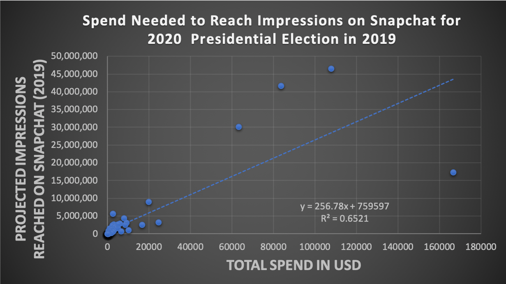

# Spend Needed to Reach Impressions on Snapchat for 2020  Presidential Election in 2019

This data analysis used a Pivot Table and Linear Regression to anyalze the 2019 Snapchat Political Ads Library. 

The link to where the data was pulled for data collection is: https://www.snap.com/en-US/political-ads/

The link to the excel file: 

## Findings

The following is the graph of the linear regression looking at the amount of spend needed to reach the specified number of impressions on snapchat for the 2020 presidential election

