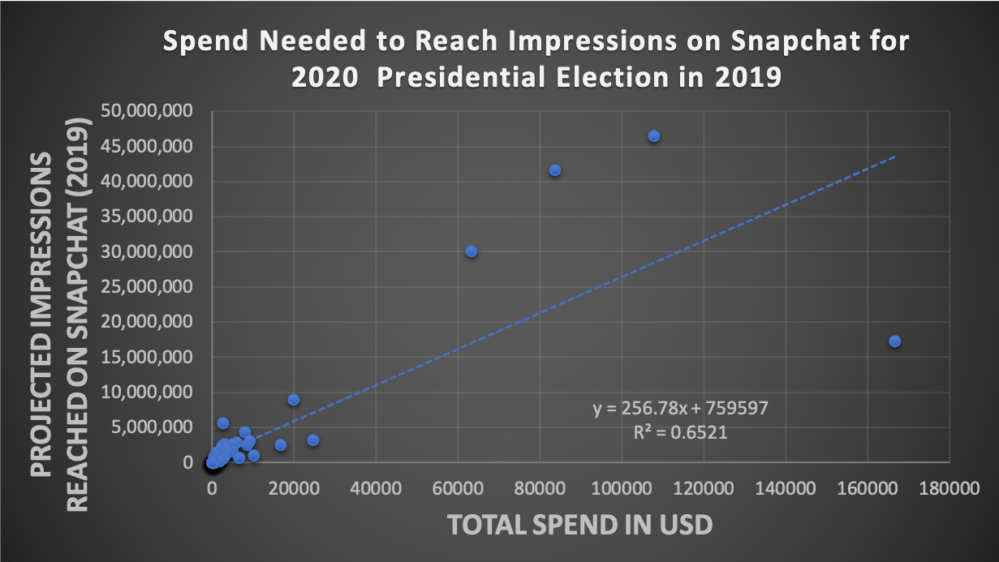
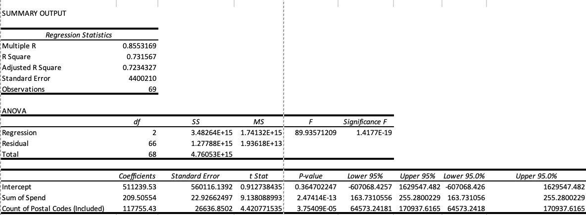

# Spend Needed to Reach Impressions on Snapchat for 2020  Presidential Election in 2019

This data analysis used a Pivot Table and Linear Regression to anyalze the 2019 Snapchat Political Ads Library. 

The link to where the data was pulled for data collection is: https://www.snap.com/en-US/political-ads/

The link to the excel file: 

## Findings

The following is the graph of the linear regression looking at the amount of spend needed to reach the specified number of impressions on snapchat for the 2020 presidential election. The business questions asked was "How much will have to be spent in order to make 1M people considers you as a candidate for the 2020 election on Snapchat?" After running the regression multiple times the two variables that could best explain the data were sum of spend and count of postal codes both having p-values less than .05 It was found that 25K must be spend to reach 7M impression. According to the Rule of Seven, it takes seven impressions before a conversion thus, 25K and 7M impressions can convert to 1M leads/conversions. 

## Impact on Baltimore City Department of Human Resources 
After looking at the findings in the graph below, Baltimore City can determine how they push political candidtes agenda and awarness amoungst the community by using the simple formula of spend and zip code. These targeted ad techniques can drive people to want to vote for a specific candidate to drive change. 

## Bloomberg and the 2020 Election
It was found that Bloomberf spend 250K and recieved 60M impressions leading to close to 8.5M convrsions. He targeted those between the ages of 24-38. When looking at historical data from the 2012 election, it was found that this age group represented 50M people, this Bloomberg was able to target 1/6 of the voters with only 250k. 

## Data Manipulation 
The data was first imported into exel and converted into the .xlsx file. 
Then it was analyzed based oto determine which variables made sense to include to get a representation of how to calculate impressions.
A pivot table was created using an array of vairbales followed by a regression which was carried out. 
This was done by clicking the data tab, going to data analysis, hitting regressions and selecting for the IV and DV. 
The Summary Output was analyzed looking at the P value, F Critical value, SE, and R-Squared value. 
Below is listed the findings from the Summary Table 

## Regression Summary Table 

p-values: Are statistically significant for sum of spend and based on postal codes as the p value is less than .05
R square: The best fit line can represent 73% of the data
F critical Value : is 89.9 which means that the data  is quite significant when looking at the joint effect of all the variables together 
Standard Error: shows that for Sum of spend (22.92) this is how much variation there is and for postial codes is 26k impressions per each postal code added
